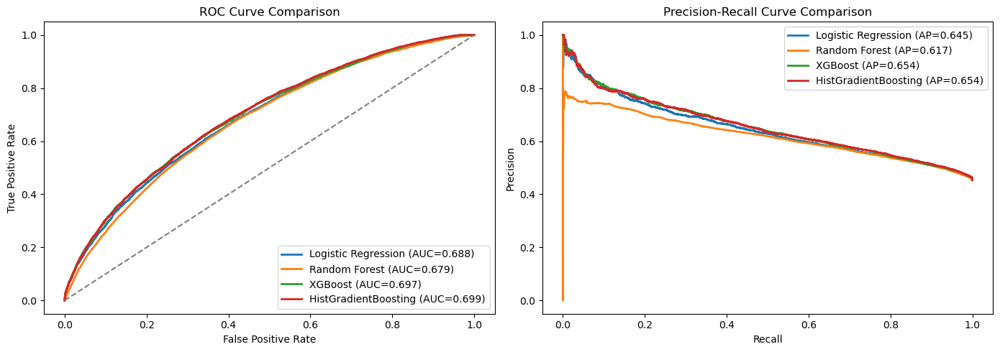
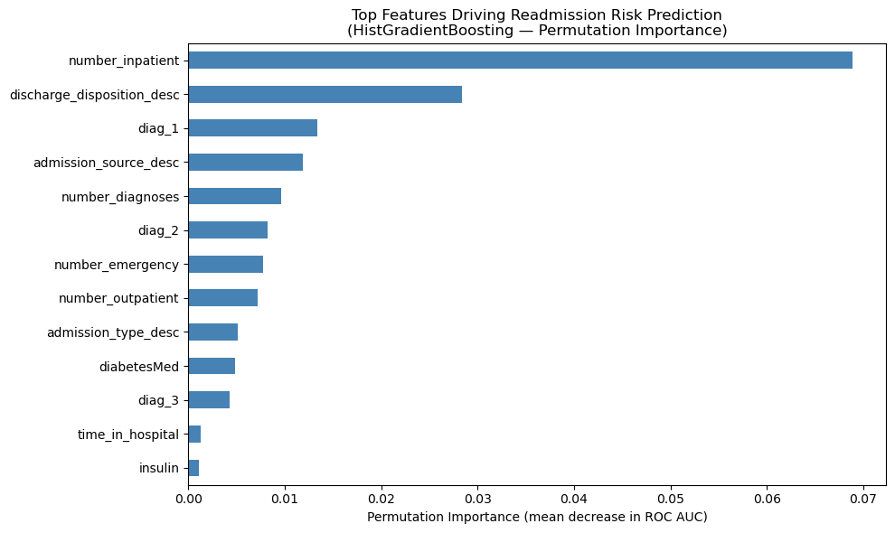

# Optimizing Post-Discharge Interventions for Diabetes Patients

> A data-driven framework that helps hospitals decide **which diabetic patients to call after discharge**, projecting **$2.24M in net savings** on a $1M intervention budget.

## Table of Contents
1. [Background and Overview](#1-background-and-overview)
2. [Data Overview](#2-data-overview)
3. [Executive Summary](#3-executive-summary)
4. [Key Findings](#4-key-findings)
5. [Recommendations](#5-recommendations)
6. [Project Structure & Quickstart](#6-project-structure--quickstart)
7. [Limitations & Caveats](#7-limitations--caveats)


## 1. Background and Overview

Every year, one in five Medicare patients is readmitted to the hospital within 30 days of discharge, a problem that costs the U.S. healthcare system an estimated **$52.4 billion annually**. Under Medicare's [Hospital Readmissions Reduction Program (HRRP)](https://www.cms.gov/medicare/payment/prospective-payment-systems/acute-inpatient-pps/hospital-readmissions-reduction-program-hrrp), hospitals are directly penalized for excessive readmission rates, making prevention a financial priority alongside a clinical one. Diabetic patients are among the most frequently readmitted groups.

Post-discharge follow-up programs such as phone calls, care plan reviews, and remote monitoring can meaningfully reduce these readmissions. But **budgets are limited**, so hospitals cannot intervene with every patient. The real question is: **who should receive an intervention to get the most impact per dollar spent?**

This project answers that question with a two-step approach:

1. **Predict**, a machine learning model estimates each patient's likelihood of being readmitted within 30 days
2. **Optimize**, a decision model selects which patients to intervene with, maximizing expected cost savings within a fixed budget


## 2. Data Overview

**Source:** [UCI ML Repository - Diabetes 130-US Hospitals (1999-2008)](https://archive.ics.uci.edu/ml/datasets/diabetes+130-us+hospitals+for+years+1999-2008)

The dataset covers **~101,766 hospital visits** from 130 U.S. hospitals over 10 years. Each row represents a single hospital stay (not a unique patient, the same patient may have multiple visits).

### What information is available?

| Category | Examples |
|---|---|
| **Patient demographics** | Age group, gender, race |
| **Hospital stay details** | How they were admitted, where they were discharged to, length of stay |
| **Medical history** | Primary diagnosis, number of previous hospital visits, number of procedures |
| **Medications** | 23 diabetes-related drugs, whether medication was changed during the visit |
| **Lab tests** | A1C result, glucose levels (limited availability, see Limitations) |
| **Outcome** | Whether the patient was readmitted within 30 days (yes/no) |

### Data preparation highlights

- Columns with more than 40% missing data were excluded
- Remaining patient records with missing fields were kept but flagged (rather than deleted or filled in with assumptions)
- The data was split so that all visits from a given patient appear in either training or testing, never both, to ensure the model is evaluated on genuinely unseen patients

### Dataset files

The data files are **not included** in this repository. Download `diabetic_data.csv` and `IDs_mapping.csv` from the UCI link above and place both in the project root before running the notebook.


## 3. Executive Summary

By combining a readmission risk model with a budget-constrained decision tool, this framework identifies the most cost-effective patients to reach after discharge.

### Bottom line

> With a **$1M intervention budget**, the model selected **1,832 out of 20,153 patient visits** for outreach, projecting **$2.24M in net savings** (a **2.24x return on investment**).

This means every dollar spent on interventions is expected to return $2.24 in avoided readmission costs.

### How the model was chosen

Four different prediction models were tested. The best-performing one, **HistGradientBoosting**, was selected because it was most accurate at estimating each patient's actual readmission probability, which is essential for making good allocation decisions downstream.

> A model that says "70% chance of readmission" should actually be right about 70% of the time. HistGradientBoosting achieved this calibration best, with a ROC AUC of **0.697** (meaning it correctly ranks a higher-risk patient above a lower-risk one 70% of the time).


*The ROC curve (left) shows how well each model separates high-risk from low-risk patients; the Precision-Recall curve (right) focuses on how accurately the model identifies patients who actually get readmitted. HistGradientBoosting leads on both.*

### Financial impact of the optimization

| | |
|---|---|
| Budget | $1,000,000 |
| Patients selected for intervention | 1,832 of 20,153 |
| Expected readmission costs *without* any intervention | $92,064,002 |
| Expected readmission costs *with* targeted intervention | $89,819,961 |
| **Net savings** | **~$2,244,041** |
| **ROI** | **2.24x** |

Importantly, the model does **not** simply call the sickest patients. About 30% of those selected would not be in the top-risk group by predicted probability alone, as they are selected because their cost profile makes intervention particularly cost-effective.


## 4. Key Findings

### 4.1 Are the selected patients actually higher risk? Yes.

A critical question for any stakeholder deploying this system is: *are we targeting the right people?* To answer this, we compared the actual (observed) readmission rates of selected vs. non-selected patients using data the model had never seen.

**The selected cohort had a materially higher real-world readmission rate than those not selected.** This confirms the pipeline is identifying patients who genuinely needed support, not patients who just happened to have favorable cost ratios on paper.

This is the single most important validation for operational credibility: the model's choices hold up against ground truth outcomes.

### 4.2 What signals matter most for predicting readmission?

To understand *what the model learned*, we measured how much each piece of patient information actually influenced the predictions. The clearest findings:

- **Where a patient goes after discharge is the strongest signal.** Patients discharged to skilled nursing facilities, other hospitals, or under home health orders are substantially more likely to be readmitted than those going straight home. This reflects care complexity and recovery conditions.

- **Prior hospitalization history matters a lot.** Patients with multiple prior inpatient stays are at significantly higher risk, as repeat utilization is a well-established warning sign.

- **Number of diagnoses and procedures captures overall medical complexity.** Patients with more concurrent conditions and more procedures in a single visit are harder to stabilize at discharge.

- **Primary diagnosis and age contribute meaningfully.** Certain diagnoses carry inherently higher complication rates; older patients face more physiological vulnerability.

These findings translate directly into a practical **discharge triage checklist**: care teams should flag patients who are being discharged to a facility (not home), have a history of prior admissions, or have high diagnostic complexity — these are the patients most likely to benefit from proactive follow-up.


*Each bar shows how much a feature influences the model's readmission predictions. Longer bars = stronger signal. Discharge destination and prior hospitalization history are consistently the top two drivers.*

### 4.3 What happens if we change the budget or the program quality?

We tested two "what if" scenarios to understand how sensitive the results are to key assumptions.

#### If the budget doubles ($1M → $2M)

| | $1M Budget | $2M Budget |
|---|---|---|
| Patients reached | 1,832 | 3,228 |
| Net savings | $2,244,042 | $3,882,751 |
| ROI | **2.24x** | **1.94x** |

**What this means:** More budget reaches more patients and generates more total savings (+$1.64M). But the return per dollar spent drops, because the most cost-effective patients are already selected at $1M. Each additional dollar works harder to find the next-best candidate.

#### If intervention quality drops slightly (effectiveness: 30% → 25%)

| | Baseline | Reduced effectiveness |
|---|---|---|
| Patients reached | 1,832 | 1,832 |
| Net savings | $2,244,042 | $1,701,972 |
| ROI | **2.24x** | **1.70x** |

**What this means:** A modest 5-percentage-point drop in how effective each intervention is — due to patient non-compliance, poorly trained coordinators, or generic call scripts — wipes out **$542K in savings**. The number of patients reached stays the same, but each intervention delivers less. **Program quality has a larger impact than program scale.**


## 5. Recommendations

1. **Invest in intervention quality before expanding coverage.** Our sensitivity analysis shows that a small drop in program effectiveness damages returns more than nearly halving the budget. Structured call protocols, trained care coordinators, and patient adherence support are higher-leverage investments than reaching more patients with lower-quality follow-up.

2. **Use discharge destination as a front-line triage signal.** The model consistently identifies where a patient is discharged as the strongest predictor of readmission risk. Clinical staff don't need algorithmic scores to start acting on this — patients going to facilities or under home health orders should receive automatic follow-up scheduling at discharge.

3. **Use the budget-ROI curve to guide resource requests.** At $1M, every dollar returns $2.24 in savings. At $2M, it returns $1.94. This declining curve gives decision-makers a defensible, data-backed way to frame budget discussions: additional spending remains worthwhile, but stakeholders should expect diminishing returns.

4. **Enrich the model with clinical lab data.** A1C levels and glucose readings are among the strongest known predictors of diabetic complications but were too sparse to use in this dataset. Any hospital with richer EHR data should incorporate these variables in future iterations.

5. **Consider equity in resource allocation.** The current model optimizes purely for cost savings. This can inadvertently concentrate interventions among patients with higher readmission costs (often older or more complex patients) while underserving others. Future versions should include constraints that ensure equitable access across demographic groups.


## 6. Project Structure & Quickstart

```
Project/
├── requirements.txt        # Python dependencies
├── PTO_diabetes.ipynb      # End-to-end notebook: preprocessing → modeling → optimization
├── images/                 # Charts exported from the notebook
│   ├── roc_pr_curves.png
│   └── feature_importance.png
├── diabetic_data.csv       # Download from UCI (not included)
└── IDs_mapping.csv         # Download from UCI (not included)
```

**1. Install dependencies**
```bash
pip install -r requirements.txt
```

**2. Download the data**

Download `diabetic_data.csv` and `IDs_mapping.csv` from the [UCI ML Repository](https://archive.ics.uci.edu/ml/datasets/diabetes+130-us+hospitals+for+years+1999-2008) and place both in the project root.

**3. Run the notebook**
```bash
jupyter notebook PTO_diabetes.ipynb
```

The notebook walks through all steps in order: data preparation → model training → optimization → scenario analysis → patient profile validation.


## 7. Limitations

| Limitation | Note |
|---|---|
| **Lab data was too sparse to use** | A1C, glucose, and weight were missing for too many patients to include reliably. The model leans more on administrative variables (visit counts, diagnoses, discharge type) as a result. |
| **Costs are estimates, not actuals** | Readmission and intervention costs are based on published benchmarks, not real hospital billing data. Actual ROI will depend on a specific hospital's cost structure. |
| **Effectiveness is assumed uniform** | A single 30% effectiveness rate is applied to all interventions. In practice, some patients and programs will do better or worse. |
| **Each visit is treated independently** | The model does not track the same patient over time. Chronic high-risk patients who repeatedly appear may be under-served by a single-encounter framework. |
| **No equity constraints** | The optimizer maximizes financial savings only. Ensuring fair access across age groups, race, or insurance type requires additional constraints not currently in the model. |


*For academic and research purposes only.*
